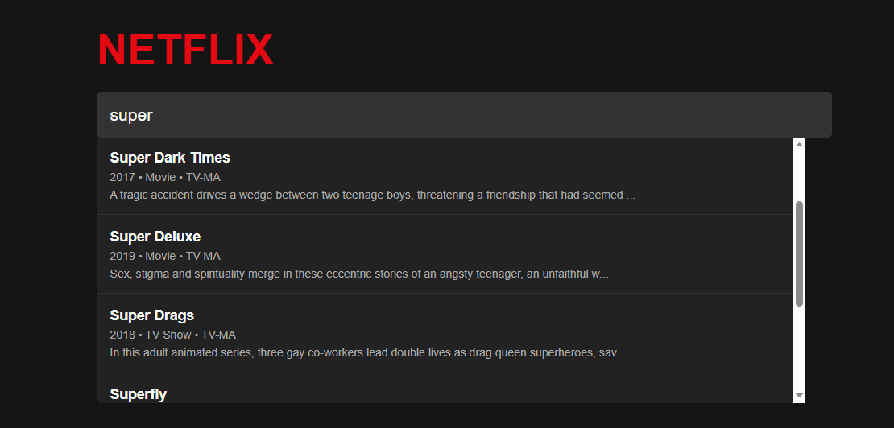

---

```markdown
# 🎬 Netflix Search Engine with NLP Text Suggestions

> Built by [Tejas Kamble](https://tejaskamble.com) – AI/ML Developer & Researcher | GitHub: [@tejask0512](https://github.com/tejask0512)

This project is a mini search engine that replicates Netflix-style search suggestions using Natural Language Processing. It uses **TF-IDF vectorization** and **cosine similarity** to return the most relevant titles based on user input.

---

## 📌 Features

- 🔍 Intelligent search suggestion using user input
- 🧠 NLP-powered recommendation based on title similarity
- 🌐 Flask-based web interface
- 🗂️ Clean and responsive UI
- 📄 Based on a real Netflix dataset

---

## 📂 Project Structure

```
Netflix_Search_Engine_NLP_Text_suggestion/
├── app.py                  # Flask web application
├── netflix_titles.csv      # Dataset of Netflix shows/movies
├── templates/
│   └── index.html          # Web UI template
├── static/
│   └── style.css           # Custom CSS styling
├── requirements.txt        # Python dependencies
└── README.md               # Project overview (this file)
```

---

## 🚀 Getting Started

### 1. Clone the Repository

```bash
git clone https://github.com/tejask0512/Netflix_Search_Engine_NLP_Text_suggestion.git
cd Netflix_Search_Engine_NLP_Text_suggestion
```

### 2. Install Dependencies

It is recommended to use a virtual environment.

```bash
pip install -r requirements.txt
```

### 3. Run the Application

```bash
python app.py
```

### 4. Open in Browser

Visit [http://127.0.0.1:5000](http://127.0.0.1:5000) to start using the search engine.

---

## 🧠 How It Works

1. **TF-IDF Vectorizer** converts all titles into numerical vectors.
2. **User input** is also vectorized in real-time.
3. **Cosine similarity** compares the input vector with all Netflix titles.
4. **Top 5 most similar results** are returned as suggestions.

---

## 📝 Example Use

Enter something like:

```
dark
```

And you'll see suggestions like:

- Dark
- Into the Night
- The Rain
- Black Mirror
- Stranger Things

---
[](https://drive.google.com/file/d/1MRHpqmi39YexdbfXPVaHLS66k6OjgcEg/view?usp=sharing)


## 💡 Future Improvements

- Use BERT or sentence-transformers for better contextual suggestions
- Integrate fuzzy matching and spell correction
- Deploy live using HuggingFace Spaces or Render
- Add search by **description**, **genre**, or **cast**

---

## 👨‍💻 Author

**Tejas Kamble**  
AI/ML Developer & Researcher  
🔗 Website: [tejaskamble.com](https://tejaskamble.com)  
🐙 GitHub: [@tejask0512](https://github.com/tejask0512)

---

## 📄 License

This project is open-source and available under the [MIT License](LICENSE).

---

## ⭐️ Show Your Support

If you found this project helpful, consider giving it a ⭐️ on GitHub and sharing it with others!

```

---

Let me know if you'd like this converted into HTML for your website or need help deploying it online!
